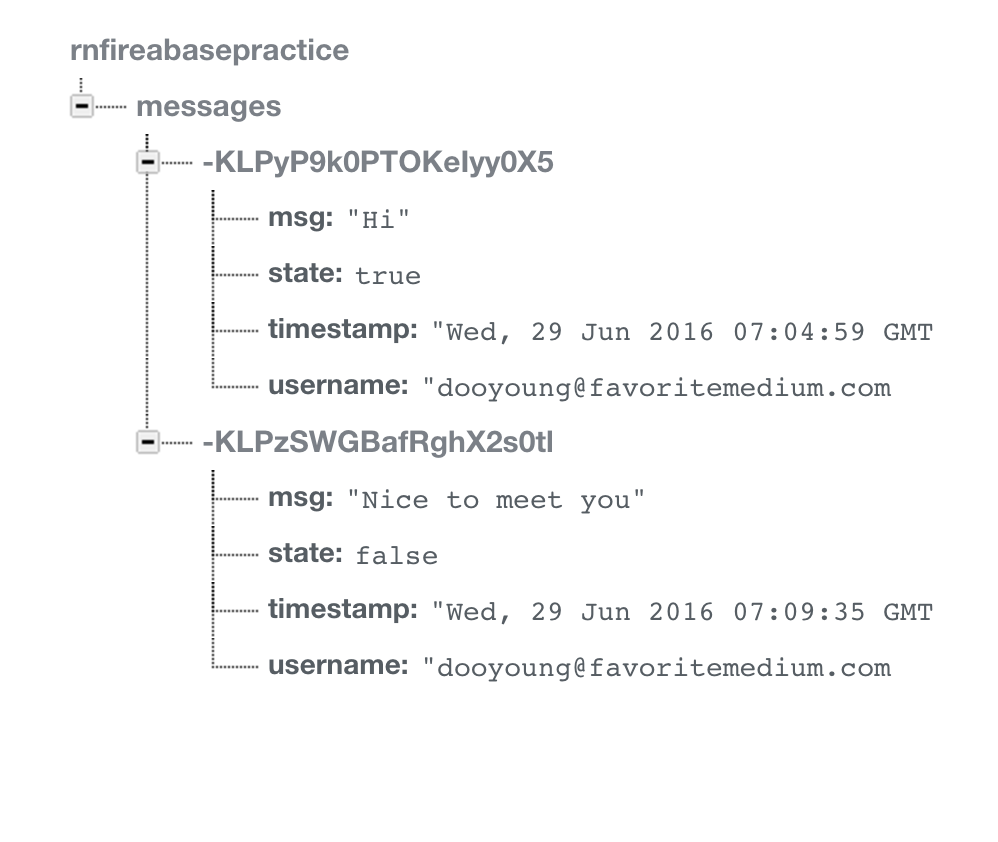

# ReactNativeFirebase
ReactNative application with firebase communication. It provides from authorization to data sync features.

===========
Features
-----
* Registering
* Log-in with registered user account.
* Authorization with firebase server.
* Update/delete data to the firebase server.
* Real-time Sync with Firebase data.
* Log-out

Setup
-----

1. Install Firebase module and Add dependency
  
  Currently, firebase@2.4.2 version is more stable.

  > npm install -g rnpm

  > rnpm install firebase@2.4.2

2. Edit Firebase path

  > let app = new Firebase('FIREBASE_URL');

  Change 'FIREBASE_URL' to your Firebase server url.

3. Registering
  Enable 'Email & Password Authentication' at the Auth page of your firebase sever before registering new account.

Screenshots
-----

Developed By
-----
* Dooyoung Gi

***
